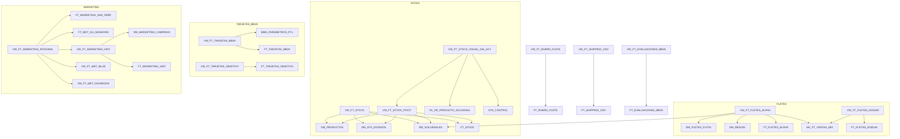

```mermaid
graph TD
  %% --- STOCK ---
  subgraph STOCK
    VW_FT_STOCK --> DM_PRODUCTOS
    VW_FT_STOCK --> DM_STK_ESTADOS
    VW_FT_STOCK --> DM_SUCURSALES
    VW_FT_STOCK --> FT_STOCK

    VW_FT_STOCK_PIVOT --> DM_PRODUCTOS
    VW_FT_STOCK_PIVOT --> DM_STK_ESTADOS
    VW_FT_STOCK_PIVOT --> DM_SUCURSALES
    VW_FT_STOCK_PIVOT --> FT_STOCK

    VW_FT_STOCK_VISUAL_DIA_ACT --> RL_PE_PRODUCTO_SUCURSAL
    VW_FT_STOCK_VISUAL_DIA_ACT --> STK_CONTROL
    VW_FT_STOCK_VISUAL_DIA_ACT --> VW_FT_STOCK_PIVOT
  end

  %% --- TARJETAS BBVA ---
  subgraph TARJETAS_BBVA
    VW_FT_TARJETAS_BBVA --> BIBA_PARAMETROS_PYL
    VW_FT_TARJETAS_BBVA --> FT_TARJETAS_BBVA
    VW_FT_TARJETAS_OBJETIVO --> FT_TARJETAS_OBJETIVO
  end

  %% --- MARKETING ---
  subgraph MARKETING
    VW_FT_MARKETING_INTEGRAL --> FT_MARKETING_ADS_PERF
    VW_FT_MARKETING_INTEGRAL --> FT_MKT_GA_SESSIONS
    VW_FT_MARKETING_INTEGRAL --> VW_FT_MARKETING_HIST
    VW_FT_MARKETING_INTEGRAL --> VW_FT_MKT_BLUE
    VW_FT_MARKETING_INTEGRAL --> VW_FT_MKT_FACEBOOK

    VW_FT_MARKETING_HIST --> DM_MARKETING_CAMPAIGN
    VW_FT_MARKETING_HIST --> FT_MARKETING_HIST
  end

  %% --- FLETES ---
  subgraph FLETES
    VW_FT_FLETES_ALPHA --> DM_FLETES_FLOTA
    VW_FT_FLETES_ALPHA --> DM_REGION
    VW_FT_FLETES_ALPHA --> DM_SUCURSALES
    VW_FT_FLETES_ALPHA --> FT_FLETES_ALPHA
    VW_FT_FLETES_ALPHA --> MV_FT_VENTAS_MIX

    VW_FT_FLETES_NODUM --> MV_FT_VENTAS_MIX
    VW_FT_FLETES_NODUM --> FT_FLETES_NODUM
  end

  %% --- OTRAS VISTAS ---
  VW_FT_RUBRO_FLETE --> FT_RUBRO_FLETE
  VW_FT_SHIPPING_CNV --> FT_SHIPPING_CNV
  VW_FT_EVALUACIONES_BBVA --> FT_EVALUACIONES_BBVA
```
